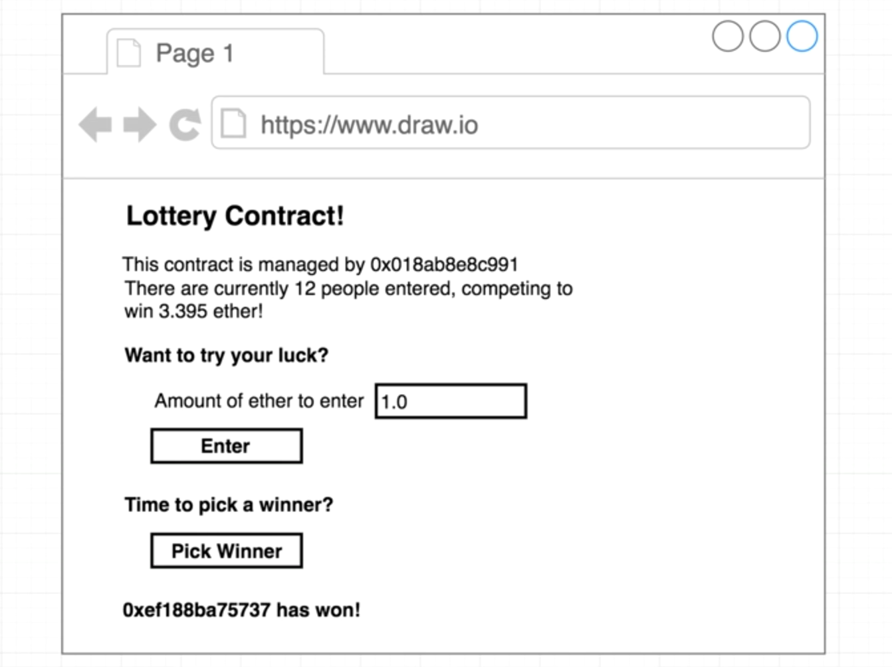

# Lottery - DAPP

Decentralize lottery application.



## Dependencies

Install these software to use this app.

- NPM: https://nodejs.org

- Metamask: https://metamask.io/

## API

Get account of Infura and paste Metamask secret key and Infura endpoint by rinkby in /Lottery_Solidity/deploy.js.

- Infura: https://infura.io/login

## Step 1. Clone the project

## Step 2. Install dependencies

```
$ cd React_Dapps_Lottery

$ npm install
```

## Step 3. Configure Metamask

- Connect metamask to Rinkby test network

## Step 4. Run the Front End Application

`$ npm start`
Visit this URL in your browser: http://localhost:3000

## Solidity

To read the original smart contract, refer to " Solidity_Lottery " repository
